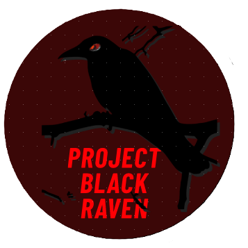

!

# Project Black Raven Advocacy Division

## Mission Statement

Project Black Raven Advocacy Division is committed to ending the adult guardianship system as it currently operates in the United States. We investigate its misuse, document its systemic failures, and[...]

## Objectives

- Conduct independent research into guardianship proceedings, statutes, and judicial behavior.
- Compile and publish evidence of abuse, neglect, and procedural violations.
- Advocate for legal reform, including the right to jury trials and federal oversight.
- Provide accessible resources for individuals, families, and legal professionals.
- Build public awareness around the consequences of unchecked guardianship authority.

## Scope of Work

This repository serves as a public archive of research, documentation, and advocacy tools. It includes formatted legal statutes, strategic analysis, and materials designed to support systemic reform. [...]

## Contact

For inquiries, collaboration, or to contribute to the project, please contact:  

## License
